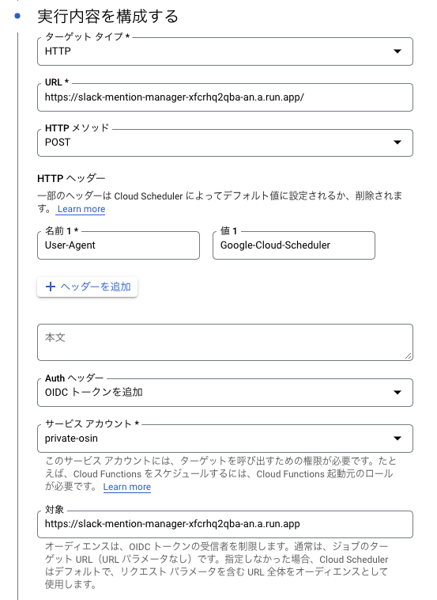

# @shintaroasuzuki/slack-mention-manager

自分がメンションされた投稿のうち、指定のリアクションをつけていない投稿を定期的にリマインドしてくれる Slack ボットです。

メンションされている投稿の、対応漏れを防ぐことができます。

## インストール方法

### Slack ボットの設定

- **OAuth & Permissions** の **Scopes** で **Bot Token Scopes** に下記の権限を付与する

  - chat:write

- **OAuth & Permissions** の **Scopes** で **User Token Scopes** に下記の権限を付与する
  - channels:history
  - channels:read
  - groups:history
  - groups:read
  - im:history
  - im:read
  - mpim:history
  - mpim:read

### Cloud Run の設定

- サービスアカウントの作成
  - 下記の権限を付与
    - Cloud Run 管理者
    - Cloud Run サービスエージェント
    - ストレージ管理者
- サービスアカウントキーを発行

### GitHub Actions の設定

- リモートレポジトリの **Setting** > **Secrets** > **Actions** から **Repository secrets** を登録する
  - `GCP_CREDENTIALS`
    - `cat /path/to/credentils_key.json | base64 | pbcopy` でクリップボードにコピー
  - `GCP_PROJECT_ID`
  - `GCP_REGION`
  - `REACTION_NAME`
    - :heavy-check-mark: ならば、heavy-check-mark を登録
  - `SERVICE_NAME`
  - `SLACK_BOT_TOKEN`
  - `SLACK_CHANNEL_ID`
    - リマインド投稿をするチャンネル
  - `SLACK_USER_ID`
    - 自分の Slack メンバー ID
  - `SLACK_USER_TOKEN`

### このソースコードを GitHub にプッシュ

- GitHub Actions の設定をしているため、アプリケーションが Cloud Run に自動デプロイされます

### Cloud Scheduler の起動

- 下記の構成で Cloud Scheduler を起動
  - Cloud Run の管理用のサービスアカウントを指定する
    
